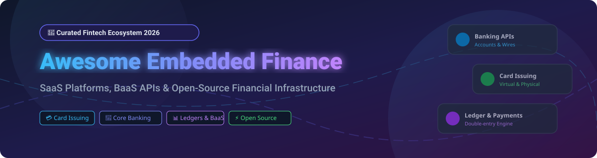

# Awesome-Embedded-Finance-Platform 🚀



### Top Embedded Finance Platform Ecosystem 💳 🏦 ⚡

<a href="https://github.com/ishandutta2007/Awesome-Awesome-Awesome"></a><a href="https://discord.gg/jc4xtF58Ve"></a> <a href="https://github.com/ishandutta2007/Awesome-Embedded-Finance-Platform"></a> <a href="https://github.com/ishandutta2007/Awesome-Embedded-Finance-Platform/network/members"></a> <a href="https://github.com/ishandutta2007/Awesome-Embedded-Finance-Platform/blob/main/LICENSE"></a> <a href="https://github.com/ishandutta2007"></a>

**Curated List of SaaS Products & Open-Source GitHub Projects for Embedded Banking, Card Issuing, Payments, Ledger Infrastructure & Banking-as-a-Service (BaaS)**
*Last updated: September 2026* 📅

---

## 📌 Overview & Market Insights 💡

> **Market Size & Structure**: The global **Embedded Finance Market** is estimated at **$110 Billion+ (2026)** and projected to exceed **$380 Billion by 2032**, expanding at a CAGR of ~28%. The sector is **moderately fragmented**, featuring massive mega-scale payment processors (Adyen, Stripe) operating alongside specialized niche Banking-as-a-Service (BaaS) and programmable ledger startups (Unit, Formance, Treasury Prime, Swan).

This repository tracks top-tier **SaaS/hosted platforms** and active **open-source GitHub projects** for building **Embedded Finance Platform Architecture**. These solutions allow vertical SaaS providers, e-commerce marketplaces, digital banks, and enterprise applications to directly embed bank accounts, virtual/physical cards, instant payment rails (ACH, RTP, FedNow, SEPA), lending, and automated double-entry ledgers into their native user journeys.

---

## 📑 Table of Contents

- [📌 Overview \& Market Insights 💡](#-overview--market-insights-)
- [🏢 Top SaaS / Hosted Embedded Finance Platforms](#-top-saas--hosted-embedded-finance-platforms)
- [⚡ Open-Source GitHub Projects](#-open-source-github-projects)
- [🤝 How to Contribute](#-how-to-contribute)
- [💖 Support & Acknowledgments](#-support--acknowledgments)
- [📈 Star History](#-star-history)
- [⚠️ Disclaimer](#️-disclaimer)

---

## 🏢 Top SaaS / Hosted Embedded Finance Platforms

The following SaaS platforms provide hosted APIs, compliance frameworks, sponsor-bank connections, and turnkey financial operations. Sorted by **Estimated Valuation / Enterprise Size (Descending)** 📊:

| Platform | Key Features & Capabilities | Estimated Valuation / Size | Starting Pricing | Free Tier / Trial Limit |
| :--- | :--- | :--- | :--- | :--- |
| **[Stripe Treasury & Issuing](https://stripe.com/treasury)** 💳 | Embedded financial accounts, ACH/wire rails, programmable card issuing, and balance management. | **$70.0 Billion+** | $0.10/card issued + 1.5% + $0.10 per transaction | Pay-as-you-go; test mode sandbox included (no monthly fee) |
| **[Adyen](https://www.adyen.com/)** 🌍 | Global payment processing, multi-currency accounts, embedded card issuing, and risk management. | **$45.0 Billion+** | $0.13 processing fee + payment method fee per transaction | Standard test accounts free with full API access |
| **[Airwallex](https://www.airwallex.com/)** ✈️ | Global financial accounts, FX transfer, multi-currency debit card issuing, and payment payouts. | **$5.6 Billion** | 0.4%–1.0% FX markup; $0 account maintenance fees | Free multi-currency account setup with sandbox access |
| **[Marqeta](https://www.marqeta.com/)** 💳 | Modern card issuing platform providing just-in-time funding and custom debit/credit card controls. | **$3.5 Billion** | ~$0.05 - $0.15 per active card/month + volume tiering | Free developer sandbox access with virtual test cards |
| **[Nium](https://www.nium.com/)** 🌐 | Real-time global payouts, multi-currency account creation, and white-label card issuing. | **$1.4 Billion** | $0.50 - $2.00 per payout transfer | Free API sandbox access for enterprise testing |
| **[Galileo](https://www.galileo-ft.com/)** 🏛️ | Financial technology API platform supporting debit/credit accounts, card processing, and BaaS. | **$1.2 Billion+** | $1,000/month platform fee + usage scale | Developer sandbox access upon partner application |
| **[Rapyd](https://www.rapyd.net/)** 💵 | Fintech-as-a-Service providing global payouts, payment collection, wallets, and card issuing. | **$1.0 Billion+** | 1.2% + $0.30 per local transaction | Free developer sandbox account with sandbox keys |
| **[Unit](https://www.unit.co/)** 🏦 | Banking-as-a-Service API platform for deposit accounts, cards, payments, and lending infrastructure. | **$1.2 Billion** | $500/month starter plan + per-account fees | Free test environment sandbox with simulated bank rails |
| **[Solaris](https://www.solarisgroup.com/)** 🇪🇺 | European licensed BaaS platform for digital bank accounts, cards, KYC, and lending products. | **$1.6 Billion** | €1,500/month enterprise core fee + per-user fee | Enterprise partner sandbox upon approval |
| **[Swan](https://www.swan.io/)** 🦢 | European API-first embedded banking platform providing SEPA IBANs, cards, and credit workflows. | **$350 Million** | €499/month startup plan + €1/card/month | Free instant sandbox account (unlimited testing) |
| **[ClearBank](https://clear.bank/)** 🇬🇧 | UK clearing bank providing real-time clearing, bank accounts, and API banking infrastructure. | **$500 Million** | £500/month clearing tier + per-wire transaction fees | Sandbox available for registered financial institutions |
| **[Treasury Prime](https://www.treasuryprime.com/)** ⛓️ | Multi-bank direct API integration platform connecting fintechs to bank partners for accounts & wires. | **$300 Million** | $1,500/month base subscription + usage fees | Free sandbox environment with API key generator |
| **[Unit21](https://www.unit21.ai/)** 🛡️ | Transaction monitoring, AML risk detection, identity verification, and case management APIs. | **$300 Million** | $2,000/month compliance starter bundle | 14-day full developer trial with test datasets |
| **[Synctera](https://www.synctera.com/)** 🤝 | BaaS matchmaker and ledger platform connecting fintech startups with sponsor bank partners. | **$150 Million** | $1,000/month base platform access | Sandbox developer plan free with mock banking data |
| **[Bond](https://www.bond.tech/)** 💳 | Embedded finance infrastructure for credit cards, commercial accounts, and identity workflows. | **$150 Million** | $750/month base plan + usage-based account fee | Free sandbox access for testing cards and ledgers |
| **[Moov](https://moov.io/)** ⚡ | Developer-first payment processor and ledger platform for ACH, RTP, FedNow, and card processing. | **$100 Million** | $0.25 per ACH transfer + 2.9% + $0.30 card rate | Free developer account with immediate sandbox keys |
| **[Column](https://column.com/)** 🏛️ | Nationally chartered developer bank offering direct core banking, Fedwire, ACH, and ledger APIs. | **$100 Million+** | $0.10 per ACH transaction; $1.00 per Fedwire | Free developer sandbox access with instant test keys |
| **[Increase](https://increase.com/)** 📈 | Programmatic banking infrastructure for ACH, wires, check deposit, and debit card issuing. | **$100 Million+** | $0.25 per ACH; $2.50 per wire transfer | Sandbox mode included for developer testing |
| **[Griffin](https://www.griffin.com/)** 🦉 | UK-licensed API-driven bank offering embedded business accounts, ledger, and customer onboarding. | **$80 Million** | £250/month base plan + per-account transaction cost | Free sandbox environment for instant integration test |
| **[Weavr](https://www.weavr.io/)** 🧩 | Plug-and-play embedded finance model offering managed accounts, cards, and compliance. | **$70 Million** | €299/month launch plan + per-active-card fees | 30-day free sandbox trial with pre-built UI components |
| **[Railz](https://railz.ai/)** 📊 | Financial data API normalizing accounting, banking, and commerce data across multiple systems. | **$50 Million** | $250/month starter tier for up to 50 connections | 14-day free trial (up to 10 test business connections) |
| **[Railsr](https://www.railsr.com/)** 💳 | Embedded banking and card issuing APIs supporting custom rewards, wallets, and credit cards. | **$50 Million** | £1,000/month base program fee | Partner sandbox environment upon developer onboarding |
| **[Toqio](https://toqio.co/)** 🧱 | Modular embedded finance solution for corporations to launch custom financial products. | **$30 Million** | €800/month starter module package | Free demo sandbox environment upon request |
| **[Integrated Finance](https://integrated.finance/)** ⚙️ | Financial API orchestrator connecting core banking, payments, and compliance providers. | **$20 Million** | £350/month middleware platform fee | 30-day free sandbox access with pre-configured mock APIs |
| **[Fuse Finance](https://www.fusefinance.com/)** 🔌 | Embedded banking API layer enabling vertical SaaS applications to offer financial tools. | **$15 Million** | $500/month platform fee + usage scale | Free developer sandbox with simulated ACH transactions |

---

## ⚡ Open-Source GitHub Projects

Self-hosted microservices, programmable ledger engines, open banking APIs, core banking suites, and payment orchestration engines. Sorted by **GitHub Star Count (Descending)** ⭐:

| Repository | Stars | Category & Focus | Description |
| :--- | :---: | :--- | :--- |
| **[postgres/postgres](https://github.com/postgres/postgres/stargazers)** | [](https://github.com/postgres/postgres/stargazers) | Database & Storage | World's most advanced open-source relational database, standard persistence layer for ledgers and banking transactions. |
| **[apache/kafka](https://github.com/apache/kafka/stargazers)** | [](https://github.com/apache/kafka/stargazers) | Event Streaming | Distributed event streaming platform powering high-throughput transaction streams, audit trails, and financial events. |
| **[keycloak/keycloak](https://github.com/keycloak/keycloak/stargazers)** | [](https://github.com/keycloak/keycloak/stargazers) | Identity & Auth | Open-source identity and access management for OAuth2/OIDC, customer authentication, and multi-tenant security. |
| **[traefik/traefik](https://github.com/traefik/traefik/stargazers)** | [](https://github.com/traefik/traefik/stargazers) | API Gateway | Modern cloud-native reverse proxy and ingress controller for securing banking and financial microservices. |
| **[temporalio/temporal](https://github.com/temporalio/temporal/stargazers)** | [](https://github.com/temporalio/temporal/stargazers) | Workflow Engine | Resilient workflow orchestration engine for financial transactions, onboarding, ACH clearing, and settlement flows. |
| **[Kong/kong](https://github.com/Kong/kong/stargazers)** | [](https://github.com/Kong/kong/stargazers) | API Gateway | Cloud-native API gateway providing authentication, rate limiting, and security for embedded financial services. |
| **[opensearch-project/OpenSearch](https://github.com/opensearch-project/OpenSearch/stargazers)** | [](https://github.com/opensearch-project/OpenSearch/stargazers) | Search & Analytics | Distributed search and analytics suite for transaction search, compliance audit logs, and fraud detection. |
| **[minio/minio](https://github.com/minio/minio/stargazers)** | [](https://github.com/minio/minio/stargazers) | Object Storage | High-performance S3-compatible object storage for KYC document verification, bank statements, and audit records. |
| **[hashicorp/vault](https://github.com/hashicorp/vault/stargazers)** | [](https://github.com/hashicorp/vault/stargazers) | Secrets & Security | Manage secrets, tokens, API keys, and data encryption for sensitive financial applications. |
| **[cockroachdb/cockroach](https://github.com/cockroachdb/cockroach/stargazers)** | [](https://github.com/cockroachdb/cockroach/stargazers) | Distributed Database | Distributed SQL database providing serializable ACID transactions for global banking platforms. |
| **[open-policy-agent/opa](https://github.com/open-policy-agent/opa/stargazers)** | [](https://github.com/open-policy-agent/opa/stargazers) | Policy & Compliance | General-purpose policy engine for evaluating transaction rules, authorization limits, and compliance checks. |
| **[apache/camel](https://github.com/apache/camel/stargazers)** | [](https://github.com/apache/camel/stargazers) | Integration Framework | Versatile enterprise integration pattern framework connecting banking protocols, message queues, and legacy systems. |
| **[frappe/erpnext](https://github.com/frappe/erpnext/stargazers)** | [](https://github.com/frappe/erpnext/stargazers) | Accounting & ERP | Open-source ERP system with accounting, ledger, invoicing, and financial management modules. |
| **[odoo/odoo](https://github.com/odoo/odoo/stargazers)** | [](https://github.com/odoo/odoo/stargazers) | Business & ERP | Suite of open-source business apps including double-entry accounting, invoicing, and payment processing. |
| **[rabbitmq/rabbitmq-server](https://github.com/rabbitmq/rabbitmq-server/stargazers)** | [](https://github.com/rabbitmq/rabbitmq-server/stargazers) | Message Broker | Lightweight message broker for event-driven payment processing, message queuing, and notifications. |
| **[nats-io/nats-server](https://github.com/nats-io/nats-server/stargazers)** | [](https://github.com/nats-io/nats-server/stargazers) | Messaging | Ultra-fast cloud-native messaging system powering event-driven microservices in fintech. |
| **[firefly-iii/firefly-iii](https://github.com/firefly-iii/firefly-iii/stargazers)** | [](https://github.com/firefly-iii/firefly-iii/stargazers) | Personal Finance | Free personal finance manager featuring transaction rules, account management, and open API access. |
| **[apache/apisix](https://github.com/apache/apisix/stargazers)** | [](https://github.com/apache/apisix/stargazers) | API Gateway | High-performance API gateway handling security, routing, and traffic control for financial endpoints. |
| **[juspay/hyperswitch](https://github.com/juspay/hyperswitch/stargazers)** | [](https://github.com/juspay/hyperswitch/stargazers) | Payment Orchestration | Open-source payment switch for routing, vaulting, retries, and multi-processor integration written in Rust. |
| **[openfga/openfga](https://github.com/openfga/openfga/stargazers)** | [](https://github.com/openfga/openfga/stargazers) | Authorization Engine | Fine-grained authorization system based on Google Zanzibar for complex financial access control. |
| **[camunda/camunda](https://github.com/camunda/camunda/stargazers)** | [](https://github.com/camunda/camunda/stargazers) | Process Automation | BPMN-compliant process orchestration engine for complex financial onboarding and compliance flows. |
| **[getlago/lago](https://github.com/getlago/lago/stargazers)** | [](https://github.com/getlago/lago/stargazers) | Usage-Based Billing | Open-source metering and usage-based billing engine designed for developer tools and fintech APIs. |
| **[mojaloop/mojaloop](https://github.com/mojaloop/mojaloop/stargazers)** | [](https://github.com/mojaloop/mojaloop/stargazers) | Interoperable Payments | Open-source software for building digital payment switches connecting financial service providers. |
| **[apache/fineract](https://github.com/apache/fineract/stargazers)** | [](https://github.com/apache/fineract/stargazers) | Core Banking Engine | Production-grade core banking engine for deposits, loans, savings products, and interest calculation. |
| **[ledger/ledger](https://github.com/ledger/ledger/stargazers)** | [](https://github.com/ledger/ledger/stargazers) | Command Line Accounting | Powerful command-line double-entry accounting engine written in C++ for fast financial calculations. |
| **[beancount/beancount](https://github.com/beancount/beancount/stargazers)** | [](https://github.com/beancount/beancount/stargazers) | Plain Text Ledger | Double-entry computer-based financial tracking engine with custom Python scripts and reporting tools. |
| **[simonmichael/hledger](https://github.com/simonmichael/hledger/stargazers)** | [](https://github.com/simonmichael/hledger/stargazers) | Plain Text Accounting | Cross-platform software for tracking money using plain-text double-entry accounting files. |
| **[killbill/killbill](https://github.com/killbill/killbill/stargazers)** | [](https://github.com/killbill/killbill/stargazers) | Billing & Payment | Open-source subscription management and payment platform with pluggable payment gateway connectors. |
| **[gnucash/gnucash](https://github.com/gnucash/gnucash/stargazers)** | [](https://github.com/gnucash/gnucash/stargazers) | Accounting Software | Double-entry bookkeeping software for personal and small-business financial accounting. |
| **[formancehq/ledger](https://github.com/formancehq/ledger/stargazers)** | [](https://github.com/formancehq/ledger/stargazers) | Programmable Ledger | Cloud-native double-entry ledger optimized for programmable financial flows and atomic transactions. |
| **[openMF/mifos-x](https://github.com/openMF/mifos-x/stargazers)** | [](https://github.com/openMF/mifos-x/stargazers) | Core Banking Suite | Full web UI and management client for Apache Fineract core banking engine. |
| **[moov-io/ach](https://github.com/moov-io/ach/stargazers)** | [](https://github.com/moov-io/ach/stargazers) | ACH Processing | Go implementation for generating, reading, validating, and writing NACHA ACH payment files. |
| **[opensanctions/opensanctions](https://github.com/opensanctions/opensanctions/stargazers)** | [](https://github.com/opensanctions/opensanctions/stargazers) | AML & Sanctions Data | Open database and tooling for screening political figures, sanctions lists, and financial risks. |
| **[jpos/jPOS](https://github.com/jpos/jPOS/stargazers)** | [](https://github.com/jpos/jPOS/stargazers) | ISO 8583 Messaging | Enterprise Java framework for financial transaction processing and payment terminal switches. |
| **[LerianStudio/midaz](https://github.com/LerianStudio/midaz/stargazers)** | [](https://github.com/LerianStudio/midaz/stargazers) | Financial Ledger | Multi-asset financial ledger engine engineered for real-time double-entry balances and auditing. |
| **[flash-oss/medici](https://github.com/flash-oss/medici/stargazers)** | [](https://github.com/flash-oss/medici/stargazers) | Node.js Double-Entry | Double-entry accounting book engine built on top of MongoDB for Node.js backend services. |
| **[OpenBankProject/OBP-API](https://github.com/OpenBankProject/OBP-API/stargazers)** | [](https://github.com/OpenBankProject/OBP-API/stargazers) | Open Banking API | Standardized middleware API server for open banking, accounts, transactions, and PSD2 compliance. |
| **[frappe/lending](https://github.com/frappe/lending/stargazers)** | [](https://github.com/frappe/lending/stargazers) | Loan Management | Open-source loan management engine covering origination, disbursements, collateral, and repayments. |
| **[moov-io/watchman](https://github.com/moov-io/watchman/stargazers)** | [](https://github.com/moov-io/watchman/stargazers) | Sanctions Screening | Microservice for searching OFAC, PEP, and sanctions lists for instant customer compliance screening. |
| **[moov-io/iso8583](https://github.com/moov-io/iso8583/stargazers)** | [](https://github.com/moov-io/iso8583/stargazers) | ISO 8583 Parser | Open-source Go library for encoding, decoding, and validating ISO 8583 card payment messages. |

---

## 🏗️ Architecture Blueprint: Practical Open Embedded Finance Stack

A developer-owned, production-grade **open-source embedded finance stack** can be constructed by composing modular layers:

```
┌────────────────────────────────────────────────────────────────────────┐
│                   Unified API Gateway Layer                            │
│                 (Kong / Traefik / Apache APISIX)                       │
└──────────────────────────────────┬─────────────────────────────────────┘
                                   │
 ┌─────────────────────────────────┼──────────────────────────────────┐
 │                                 │                                  │
 ▼                                 ▼                                  ▼
┌──────────────────────┐ ┌──────────────────────┐ ┌──────────────────┐
│  Core Banking & Loan │ │ Payments & Switching │ │ Identity & Policy│
│  (Apache Fineract /  │ │ (Hyperswitch / Moov  │ │ (Keycloak / OPA /│
│   Frappe Lending)    │ │  ACH / Mojaloop)     │ │  OpenSanctions)  │
└──────────┬───────────┘ └──────────┬───────────┘ └────────┬─────────┘
           │                        │                      │
           └──────────────────┬─────┴──────────────────────┘
                              ▼
           ┌─────────────────────────────────────┐
           │      Programmable Ledger Engine     │
           │  (Formance Ledger / Midaz / Medici) │
           └──────────────────┬──────────────────┘
                              ▼
           ┌─────────────────────────────────────┐
           │      Persistence & Event Streaming  │
           │   (PostgreSQL / Kafka / Temporal)   │
           └─────────────────────────────────────┘
```

---

## 🤝 How to Contribute

Contributions are welcome! To contribute to this curated ecosystem list:

1. **Fork** the repository.
2. Add your project or SaaS entry into the appropriate table adhering to the markdown schema.
3. Ensure pricing and free tier specs are explicitly stated (no generic "Custom" text).
4. For GitHub projects, link the repository star badge directly to its stargazers page (`https://github.com/owner/repo/stargazers`).
5. Open a **Pull Request** with a clear explanation of the platform.

---

## 💖 Support & Acknowledgments

If this curated embedded finance resource helps you build financial applications or navigate the BaaS ecosystem, please consider supporting the project:

- ⭐ **Star this repository** on GitHub to increase visibility.
- 🔀 **Fork & Share** with fellow developers and fintech engineers.
- ☕ **Sponsor the Maintainer**: [Buy a coffee on GitHub Sponsors](https://github.com/sponsors/ishandutta2007)

Thank you to all community contributors for keeping this index updated! 🙌

---

## 📈 Star History

[](https://star-history.dera.page/#ishandutta2007/Awesome-Embedded-Finance-Platform&type=date&legend=top-left)

---

## ⚠️ Disclaimer

- This list is for informational and educational purposes only.
- Embedded finance operations involve strictly regulated financial activities (banking licenses, KYC/AML compliance, electronic money, card network rules).
- Open-source software binaries do **not** grant regulatory authorization or sponsor-bank partnerships.
